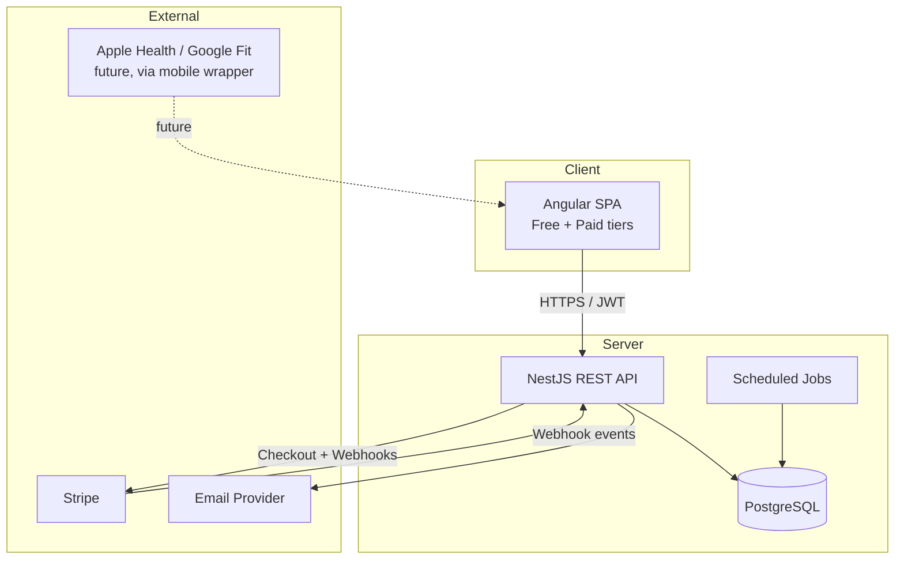
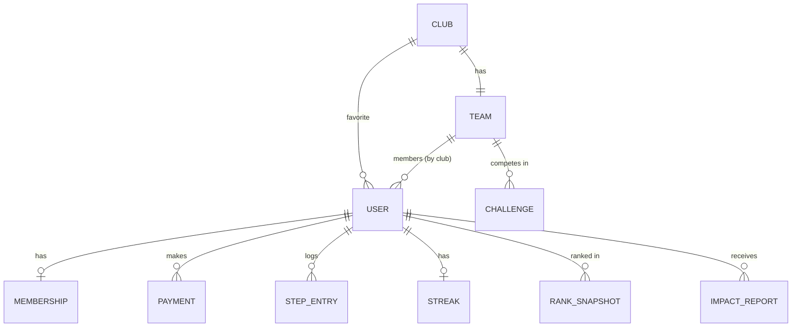

# SOB Supporter Platform — Architecture

This document describes the technical architecture for the SOB Supporter Platform
defined in [README.md](./README.md). It maps each product feature to concrete
components, data, and flows.

## 1. Technology Stack

| Layer | Choice | Notes |
|-------|--------|-------|
| Frontend | **Angular (v17+)** | Standalone components, signals, lazy-loaded routes |
| Backend | **NestJS (Node.js + TypeScript)** | Modular REST API |
| Database | **PostgreSQL** | Relational — ideal for rankings, contributions, history |
| ORM | **TypeORM** (or Prisma) | Typed entities + migrations |
| Payments | **Stripe** | Checkout + subscriptions + webhooks |
| Auth | **JWT** (access + refresh) | Password hashing with bcrypt/argon2 |
| Email | **Nodemailer / SendGrid** | Password reset, monthly impact reports |
| Scheduling | **@nestjs/schedule** | Monthly resets, report generation, snapshots |

**Step sync:** Manual entry for now. A `HealthSyncProvider` abstraction leaves a
clean seam for native Apple Health / Google Fit integration later (which requires
a Capacitor/Ionic mobile wrapper — a browser SPA cannot read those APIs directly).

---

## 2. System Overview



The system is a classic **SPA + REST API + relational DB** design. The Angular
client talks to the NestJS API over HTTPS with JWTs. Stripe handles all payments;
its webhooks keep membership status authoritative on the server. A small set of
scheduled jobs handles the time-based features (streak resets, leaderboard
snapshots, monthly impact reports).

---

## 3. Tier & Access Model

Two access levels, enforced on **both** client and server:

- **Free tier** — public landing/info pages only. No auth required.
- **Paid tier (€9.99/mo)** — all features. Requires a logged-in user **with an
  active membership**.

Enforcement:
- **Frontend:** route guards — `authGuard` (logged in) and `membershipGuard`
  (active subscription) protect paid routes.
- **Backend:** `JwtAuthGuard` + `MembershipGuard` protect paid endpoints. The
  server is the source of truth; the client guard is only for UX.

---

## 4. Frontend Architecture (Angular)

Lazy-loaded feature areas, each mapping to a README feature:

```
src/app/
├── core/                 # singletons: auth, http interceptors, guards, config
│   ├── auth/             # token storage, auth state (signals), interceptor
│   ├── guards/           # authGuard, membershipGuard
│   └── api/              # typed API client services
├── shared/               # reusable UI components, pipes (e.g. steps→km), models
├── features/
│   ├── landing/          # FREE: program info, marketing, sign-up CTA
│   ├── auth/             # sign up (+ club select), login, password reset
│   ├── membership/       # Stripe checkout, status, contribution total, cancel
│   ├── dashboard/        # PAID: personal overview (steps, streak, rank)
│   ├── steps/            # PAID: log/view daily/weekly/monthly steps, streaks
│   ├── challenges/       # PAID: team challenge + milestone progress
│   ├── leaderboards/     # PAID: individual / team / streak rankings
│   ├── updates/          # PAID: SOB updates, mission & impact stories
│   ├── impact-reports/   # PAID: monthly personal impact report
│   └── profile/          # PAID: profile & settings management
└── app.routes.ts         # top-level routing with lazy loading
```

- **State:** lightweight service + Angular **signals** (NgRx is overkill at this
  scale). Auth/membership state lives in core singleton services.
- **HTTP:** an interceptor attaches the JWT and handles 401 → refresh/logout.
- **Units conversion:** a shared `stepsToKm` pipe (`1 km = 1,250 steps`) so the
  rule lives in exactly one place.

---

## 5. Backend Architecture (NestJS)

One module per bounded responsibility:

| Module | Responsibility | README feature |
|--------|----------------|----------------|
| `AuthModule` | Register, login, JWT, refresh, password reset | §1 Authentication |
| `UsersModule` | Profile, settings, favorite club | §1 Profile mgmt |
| `ClubsModule` | Club catalog (chosen at signup) | §1 / §4 |
| `MembershipModule` | Stripe customers, subscriptions, webhooks, status | §2 Membership |
| `PaymentsModule` | Contribution records / history | §2 |
| `StepsModule` | Log steps, history, km conversion, streaks | §3 Step Tracking |
| `TeamsModule` | Team per club, membership-by-club | §4 / §6 |
| `ChallengesModule` | Monthly challenges + milestone progress | §4 Challenges |
| `LeaderboardModule` | Individual/team/streak rankings + rank deltas | §6 Leaderboards |
| `UpdatesModule` | SOB updates, mission & impact stories | §5 Updates |
| `ImpactReportsModule` | Generate & deliver monthly impact reports | §7 Reports |
| `MailModule` | Transactional email (shared) | cross-cutting |
| `ScheduleModule` | Cron jobs (resets, snapshots, reports) | cross-cutting |

Conventions: DTOs validated with `class-validator`, global exception filter for
consistent error shapes, guards for auth/membership, `ConfigModule` for env vars.

---

## 6. Data Model (PostgreSQL)

Core entities and key relationships:



| Table | Key fields |
|-------|-----------|
| `clubs` | id, name, region |
| `users` | id, email (unique), password_hash, name, favorite_club_id, created_at |
| `memberships` | id, user_id, stripe_customer_id, stripe_subscription_id, status, current_period_end, canceled_at |
| `payments` | id, user_id, amount, currency, stripe_payment_intent_id, paid_at |
| `step_entries` | id, user_id, **date**, steps, source (`manual`/`apple_health`/`google_fit`), created_at — **unique(user_id, date)** |
| `streaks` | user_id, current_streak, longest_streak, last_logged_date |
| `teams` | id, club_id, name |
| `challenges` | id, team_id, title, target_km, start_date, end_date |
| `challenge_progress` | challenge_id, total_km, updated_at |
| `rank_snapshots` | id, user_id, period (week), rank, total_km, captured_at — powers week-over-week ↑/↓ arrows |
| `updates` | id, type (update/story/event), title, body, media_url, published_at |
| `impact_reports` | id, user_id, period (month), amount_contributed, funding_breakdown (jsonb), athletes_impacted, clubs_supported (jsonb), generated_at |

Distance is **derived** from steps (`km = steps / 1250`), not stored, to avoid
drift.

---

## 7. Key Flows

**Sign-up & club selection**
1. User submits email/password + selects favorite club.
2. Backend hashes password, creates user, links club, issues JWTs.

**Membership purchase (Stripe)**
1. Client requests a Stripe Checkout session from `MembershipModule`.
2. User pays on Stripe-hosted checkout.
3. Stripe **webhook** (`checkout.session.completed`, `invoice.paid`,
   `customer.subscription.*`) updates membership status — the server never trusts
   the client for payment state. Webhook signatures are verified.

**Logging steps**
1. User submits steps for a date (manual entry).
2. `StepsModule` upserts the day's entry, recomputes streak, invalidates cached
   leaderboard for that user.

**Leaderboards**
- Individual: rank by total km. Team: aggregate km per club/team. Streak: rank by
  consecutive days. Weekly `rank_snapshots` enable the up/down arrows.

**Scheduled jobs**
- Monthly: reset streak leaderboard, generate & email impact reports.
- Weekly: capture `rank_snapshots` for rank-change deltas.

---

## 8. Step-Sync Extensibility (future)

```
HealthSyncProvider (interface)
├── ManualEntryProvider        ← implemented now
├── AppleHealthProvider        ← future (needs Capacitor + iOS HealthKit)
└── GoogleFitProvider          ← future (needs Capacitor + Android Health Connect)
```

`step_entries.source` already records origin, so adding a provider needs no schema
change. Real device sync requires wrapping the Angular app in **Capacitor/Ionic**;
this is intentionally out of scope for the initial web build.

---

## 9. Security & Compliance

- Passwords hashed with **bcrypt/argon2**; never stored or logged in plaintext.
- **JWT** access tokens (short-lived) + refresh tokens; HTTP-only cookie or
  bearer storage.
- Stripe **webhook signature** verification; payment state is server-authoritative.
- Server-side **input validation** (class-validator), rate limiting, strict CORS.
- **GDPR (EU/Belgium):** explicit consent, data export & deletion. Step/health
  data is personal data — handle with care, minimize, and document retention.

---

## 10. Testing & Deployment

- **Backend:** Jest unit tests per service + e2e tests on a test PostgreSQL.
- **Frontend:** component/unit tests (Jest/Karma) + Cypress E2E for key journeys
  (sign-up → pay → log steps → see rank).
- **Containerization:** Docker for API + Postgres; Stripe CLI for local webhooks.
- **CI:** lint + test on push.

---

## Feature → Component Traceability

| README feature | Frontend | Backend | Tables |
|----------------|----------|---------|--------|
| §1 Authentication | `features/auth`, `core/auth` | `AuthModule`, `UsersModule` | users, clubs |
| §2 Membership | `features/membership` | `MembershipModule`, `PaymentsModule` | memberships, payments |
| §3 Step Tracking | `features/steps` | `StepsModule` | step_entries, streaks |
| §4 Challenges | `features/challenges` | `ChallengesModule`, `TeamsModule` | challenges, challenge_progress, teams |
| §5 Updates/Stories | `features/updates` | `UpdatesModule` | updates |
| §6 Leaderboards | `features/leaderboards` | `LeaderboardModule` | rank_snapshots, step_entries, teams |
| §7 Impact Reports | `features/impact-reports` | `ImpactReportsModule`, `MailModule` | impact_reports, payments |
